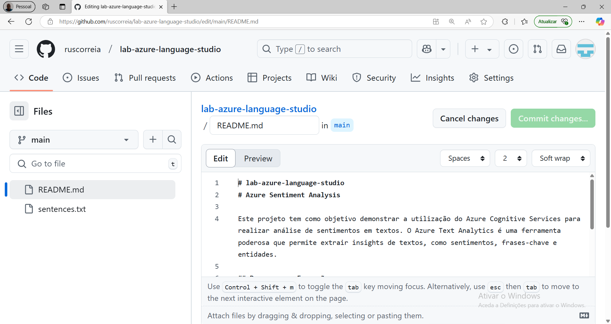
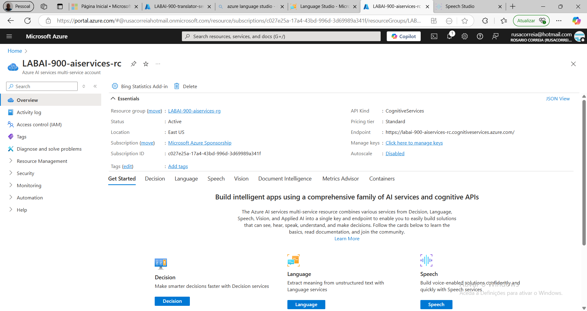
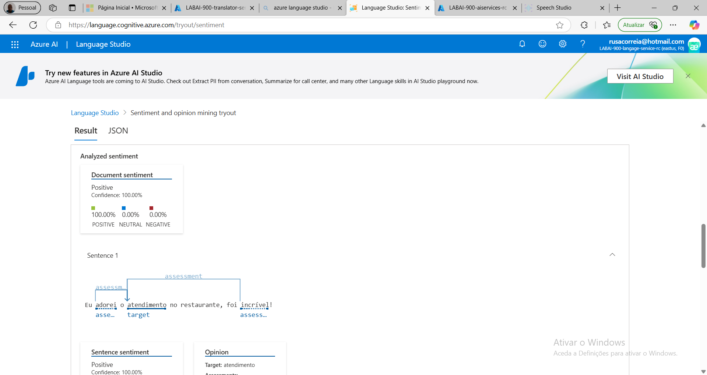

# lab-azure-language-studio
# Azure Sentiment Analysis

Este projeto tem como objetivo demonstrar a utilização do Azure Cognitive Services para realizar análise de sentimentos em textos. O Azure Text Analytics é uma ferramenta poderosa que permite extrair insights de textos, como sentimentos, frases-chave e entidades.

## Passos para Execução

1. **Criação do Repositório no GitHub**
   - Criou-se um novo repositório no GitHub.
   

2. **Estrutura do Projeto**
   - Criu-se uma pasta chamada `inputs` no diretório raiz do projeto.
   - Dentro da pasta `inputs`, criou-se o arquivo de texto  `sentences.txt` contendo algumas sentenças para análise.

3. **Configuração do Azure**
   - No portal do Azure e criou-se um recurso de `Language`.
   - Obteu-se a chave de API e o endpoint necessário para autenticar as requisições.

4. **Análise de Sentimentos**
   - Utilize o SDK do Azure ou faça requisições HTTP diretamente para o endpoint do Text Analytics.
   - Processe o arquivo `sentences.txt` e envie cada sentença para análise.
   - Armazene os resultados em um arquivo JSON ou exiba-os no console.

5. **Resultados e Insights**
   - Insights sobre o sentimento de cada sentença (positivo, negativo ou neutro):
{
    "documents": [
        {
            "id": "id__415",
            "sentiment": "positive",
            "confidenceScores": {
                "positive": 1,
                "neutral": 0,
                "negative": 0
            },
            "sentences": [
                {
                    "sentiment": "positive",
                    "confidenceScores": {
                        "positive": 1,
                        "neutral": 0,
                        "negative": 0
                    },
                    "offset": 0,
                    "length": 53,
                    "text": "Eu adorei o atendimento no restaurante, foi incrível!",
                    "targets": [
                        {
                            "sentiment": "positive",
                            "confidenceScores": {
                                "positive": 1,
                                "negative": 0
                            },
                            "offset": 12,
                            "length": 11,
                            "text": "atendimento",
                            "relations": [
                                {
                                    "relationType": "assessment",
                                    "ref": "#/documents/0/sentences/0/assessments/0"
                                },
                                {
                                    "relationType": "assessment",
                                    "ref": "#/documents/0/sentences/0/assessments/1"
                                }
                            ]
                        }
                    ],
                    "assessments": [
                        {
                            "sentiment": "positive",
                            "confidenceScores": {
                                "positive": 1,
                                "negative": 0
                            },
                            "offset": 3,
                            "length": 6,
                            "text": "adorei",
                            "isNegated": false
                        },
                        {
                            "sentiment": "positive",
                            "confidenceScores": {
                                "positive": 1,
                                "negative": 0
                            },
                            "offset": 44,
                            "length": 8,
                            "text": "incrível",
                            "isNegated": false
                        }
                    ]
                }
            ],
            "warnings": []
        }
    ],
    "errors": [],
    "modelVersion": "2024-03-01"
}

## Prints do Processo

## Possibilidades e Aprendizados

- **Automatização de Análise de Feedback**: Este projeto pode ser escalado para analisar feedbacks de clientes em larga escala, ajudando empresas a identificar pontos de melhoria.
- **Integração com Chatbots**: A análise de sentimentos pode ser integrada a chatbots para melhorar a interação com os usuários, detectando emoções e ajustando respostas conforme necessário.
- **Monitoramento de Redes Sociais**: Empresas podem utilizar essa ferramenta para monitorar o sentimento em relação à sua marca nas redes sociais.

---
